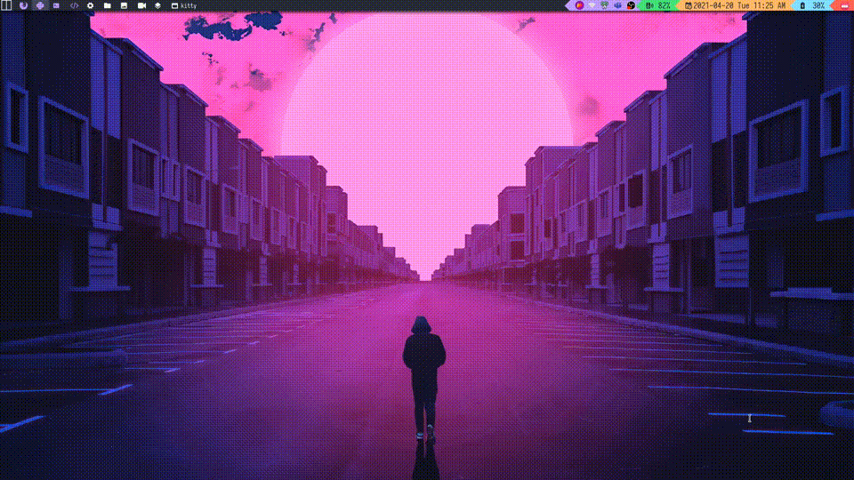
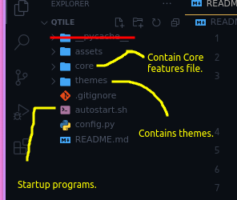

<h1 align="center">My Qtile Config. 👋</h1>

>  :dart: My Qtile Configuration with multiple themes and color scheme. <br>This README covers how you can configure this qtile config to your desktop along with some tools that you can find in the root README of my dotfiles.

<p align="center">
    
</p>

##  :file_folder: Folder Structure
- The following image shows the folder structure of the qtile configuration
<p align="center">
    
</p>

##  :boom: Autostart Programs.
- The following bash code represents the programs that i'm starting at the startup of the qtile.
- which includes.
  - `nitrogen` to set wallpapers.
  - `picom` as a  compositor.
  - `nm-applet` for the network widget bar.
  - `flameshot` a tool to take screenshots.
  - `copyq` as a clipboard manager.
```bash
#!/bin/bash
## Autostarting some neccessary apps.
nitrogen --restore &
picom -b &
nm-applet &
flameshot &
copyq &
```

##  :point_down: Join Community.
- Join out discord community to be a power ricer and power user.
- https://discord.gg/8dC7QAF6r8