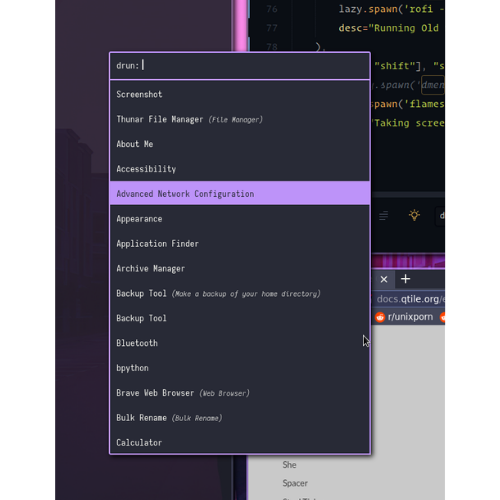

<h1 align="center"> 📓 My Rofi Config. 👋</h1>

>  :dart: My Rofi Configuration with dracula color scheme.  This README covers how you can configure this my rofi config to your desktop along with some tools that you can find in the root README of my dotfiles.

    
    
    
    

    

##  :file_folder: How i made.
- I like dracula theme just like any other coder, so i decided to take their config of rofi.
- but, that was not that much cool, or should i say, i didn't liked it.
- So i start modifying it the way i like, since it's super easy it's just CSS (kind of).
- Original Theme: https://draculatheme.com/rofi

##  :point_down: Join Community.
- Join out discord community to be a power ricer and power user.
- https://discord.gg/8dC7QAF6r8